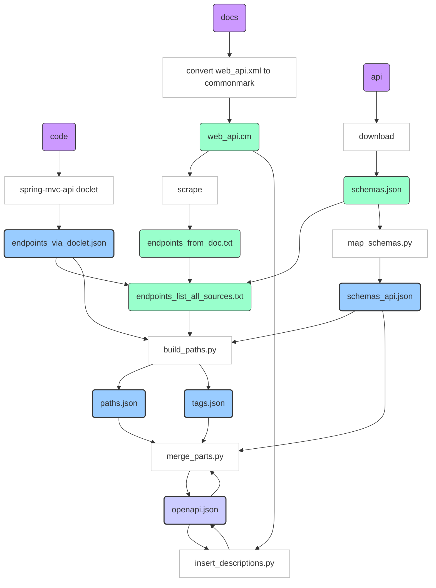

# general notes

*In case someone stumbles across this page, please be advised that these notes are mostly "to self" at the moment. I will slowly improve them to bring others on board... at which point the key parts will be added to the repo readme.*

The specification is based on OpenAPI standard.

A few additional "x-" extensions are used. The ones with a "-dhis2" suffix are unique to the dhis2 project.

|key|value|description|
||---|---|
|**x-status-dhis2**|template| generated from various sources, not yet updated manually|
||draft|work in progress|
||approved|completed, not fully tested|
||verified|tested|
|

## inputs
- doclet to pull path info from code
- endpoints "scraped" from web API document
- schemas endpoint

# testing
## CRUD test cycle

 empty DB -> create items -> read items -> update items -> read items -> delete items -> read items

 - tool will generate create/update requests from specification (test also ranges and failure cases)
 - tool keeps track of successful create/update and check with _reads_

## filtering tests

Difficult to document complex structures in specification - we may have to create tooling for these, e.g.:
- metadata object filter
- metadata field filter
- etc.

Use of OpenAPI "links" for testing?
    
___(links can be refactored)___

# descriptions derived from documentation
json pointers could perhaps be used for document references, but arrays are not really sufficiently handled, so the following convention is applied instead:
    
- The root is referred to as "DESC" - because we will use it to fill in a "description" field
- Nested dictionaries are referenced by keys delimited by "_"

so, DESC_Info will update the following:

        {
            "Info":{
                "description":"<update here!>"
            }
        }

Nested arrays cannot be traversed currently (this would require reference by index and is not maintainable). However, single arrays can be traversed; they must contain a dictionary with a "name" key. If a "name" key does not exist already, a "x-name" key can be added. The "x-name" key is searched first and is recommended to use in order to ensure a unique reference. 
- Array "name keys" are delimited with "_n-" (where the "n-" is for "Named list item"). 

so, DESC_foo_n-bar will update the following:

        {
            "foo":[
                {   
                    "description":"blah",
                    "name":"huu"
                },
                {   
                    "description":"<update here!>",
                    "name":"huu",
                    "x-name":"bar"
                },
                {   
                    "description":"blah",
                    "name":"hey"
                }
            ]
        }

DESC_foo_n-bar_pop will update the following:

        {
            "foo":[
                {   
                    "description":"blah",
                    "name":"huu"
                },
                {   
                    "description":"blah",
                    "name":"huu",
                    "x-name":"bar",
                    "pop":{
                        "description":"<update here!>",
                    }
                }
            ]
        }
        

# issues
- bug in ReDoc: readOnly objects are still shown in request body schema

# tools

(view the following with https://mermaidjs.github.io/mermaid-live-editor)
